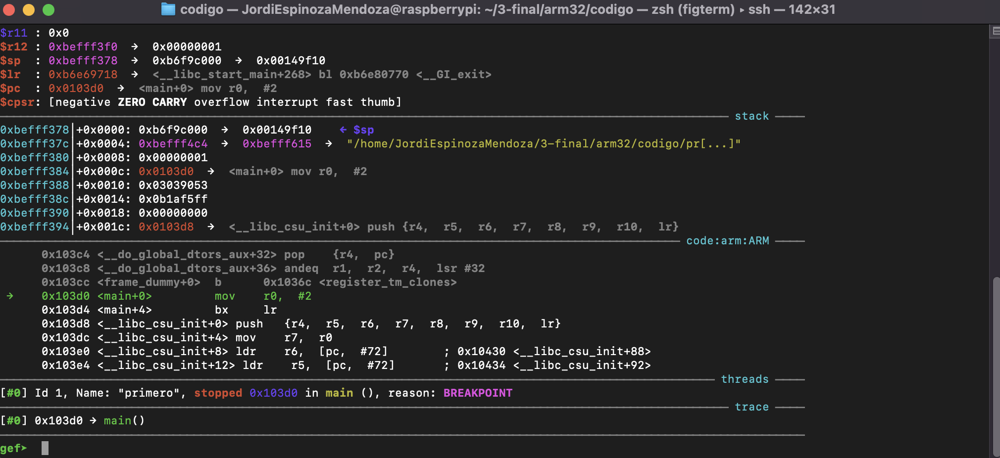
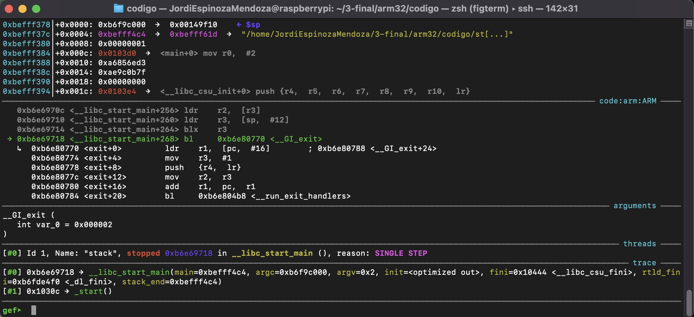
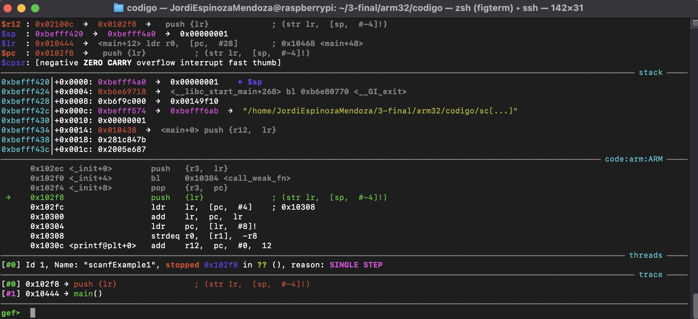
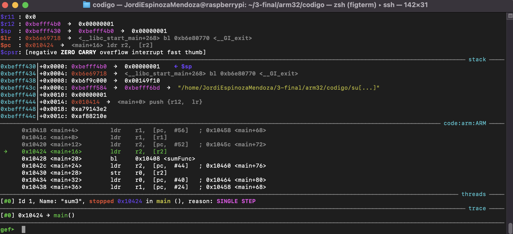
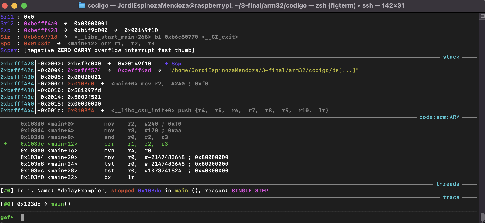
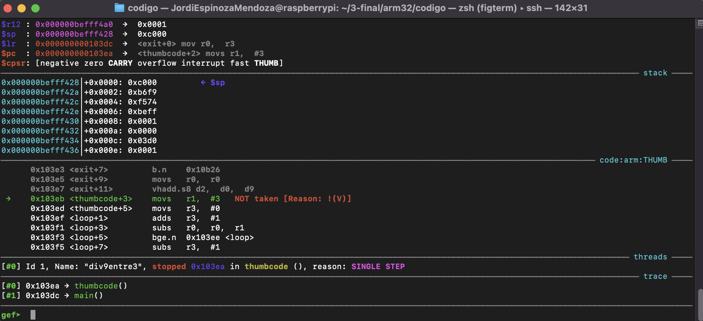
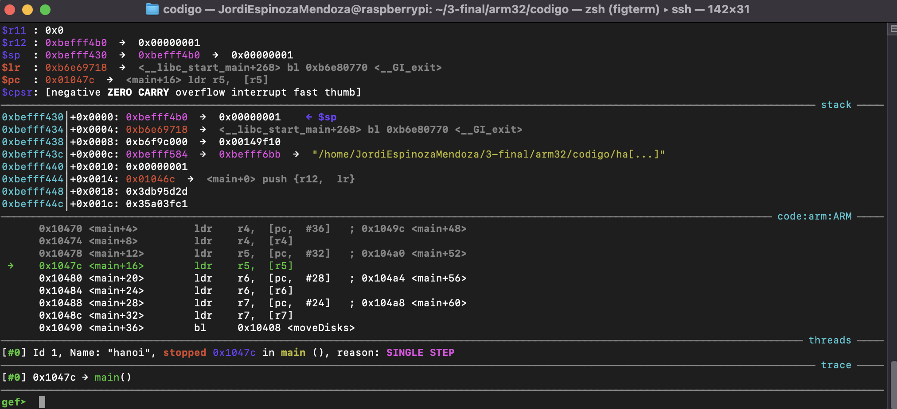
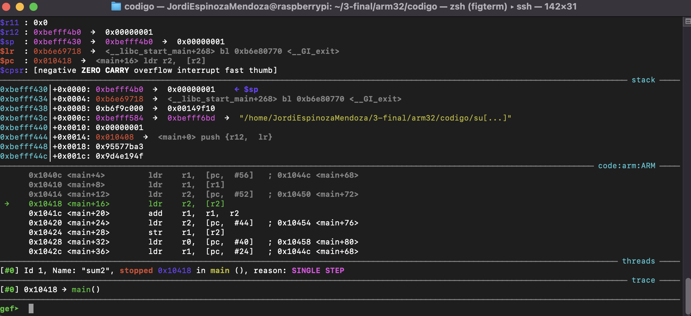

# CIERRE Tema 3: Corra los programas de ARM Assembly entregados a su revisión.

Se ha creado un archivo Makefile que ejecuta esto:

```make
compile_file:
	echo "Compiling $(input_file) ..."
	as -o $(input_file).o $(input_file).s
	gcc -o $(input_file) $(input_file).o
	./$(input_file)
        gdb $(input_file)
```
### Detalles
Se hicieron pruebas en todos los archivos contenidos en la carpeta y se recopilaron los 8 programas para su entrega, se adjunta ahora como es que se compilan y se ejecutan en gdb. Se adjunta captura de pantalla de gdb dentro de nuestra raspberry pi.
### Programa 1: primero.s

Imagen de la corrida en gdb:


### Programa 2: stack.s

Imagen de la corrida en gdb:


### Programa 3: scanfExample1.s

Imagen de la corrida en gdb:


### Programa 4: sum3.s

Imagen de la corrida en gdb:


### Programa 5: delayExample.s

Imagen de la corrida en gdb:


### Programa 6: div9entre3.s

Imagen de la corrida en gdb:


### Programa 7: hanoi.s

Imagen de la corrida en gdb:


### Programa 8: sum2.s

Imagen de la corrida en gdb:

